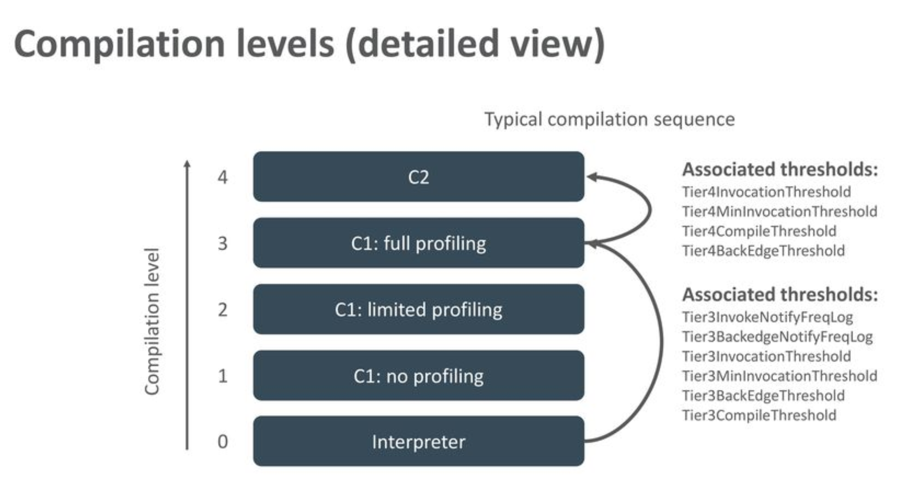
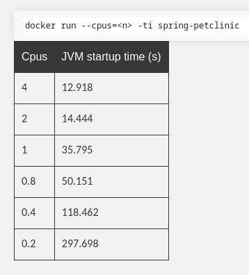
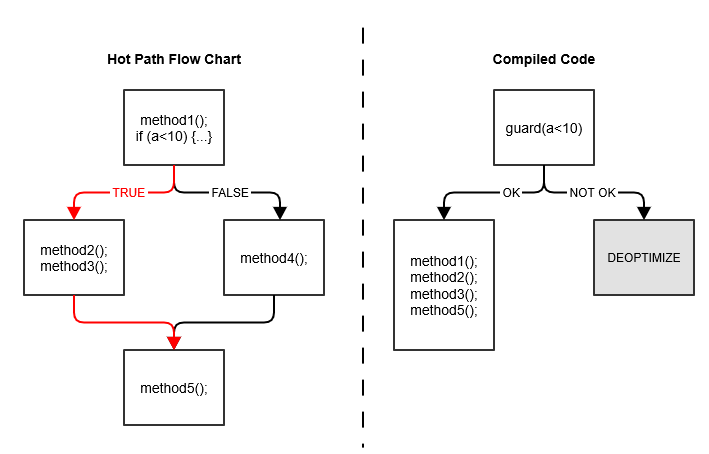

<style >
  .small-text {
    font-size: 0.55rem;
  }
</style>


# **Marp**

Markdown Presentation Ecosystem

https://marp.app/

---

# How to write slides

Split pages by horizontal ruler (`---`). It's very simple! :satisfied:

```markdown
# Slide 1

foobar

---

# Slide 2

foobar
```

---

# Tier Compilation

Habilidade de configurar qual o nível de otimização a JVM vai alcançar:


```
docker run -it -e JAVA_OPTS_APPEND=-XX:TieredStopAtLevel=4 quarkus/code-with-quarkus-jvm
docker run -it -e JAVA_OPTS_APPEND=-XX:TieredStopAtLevel=1 quarkus/code-with-quarkus-jvm
```

<a class="small-text" href="https://jpbempel.github.io/2020/05/22/startup-containers-tieredcompilation.html">https://jpbempel.github.io/2020/05/22/startup-containers-tieredcompilation.html</a>

---

# Tier Compilation

```
docker run --cpus=1 -it -e JAVA_OPTS_APPEND=-XX:TieredStopAtLevel=4 quarkus/code-with-quarkus-jvm
docker run --cpus=1 -it -e JAVA_OPTS_APPEND=-XX:TieredStopAtLevel=1 quarkus/code-with-quarkus-jvm
```



---

# Quanto o tamanho pode afetar o startup

## Size

- onbuild: 700M
- multistage: 12M

## Pull

- Onbuild: 26s
- multistage: 6s

<a class="small-text" href="https://cloud.google.com/blog/products/containers-kubernetes/kubernetes-best-practices-how-and-why-to-build-small-container-images">https://cloud.google.com/blog/products/containers-kubernetes/kubernetes-best-practices-how-and-why-to-build-small-container-images</a>

---

# Build de imagem jvm do quarkus

[Dockerfile.jvm](code-with-quarkus/src/main/docker/Dockerfile.jvm)

```bash
docker build -f src/main/docker/Dockerfile.jvm -t quarkus/code-with-quarkus-jvm .
```

```bash
docker images |grep code-with-quarkus-jvm
```

Usando imagem ubi8 da redhat, com a JVM da redhat

---

# Build de imagem jvm da distroless

[Dockerfile.distroless](code-with-quarkus/src/main/docker/Dockerfile.distroless)

```bash
docker build -f src/main/docker/Dockerfile.distroless -t quarkus/code-with-quarkus-distroless .
```

```bash
docker images |grep code-with-quarkus-distroless
```

Distroless são containers mais enxutos, contendo o mínimo de um debian, SEM shell (existe versão com/sem shell de debug, rodando como root/nonroot)
_Seguranca_

---

# Build de imagem jvm da distroless customizado

[Dockerfile.customdistroless](code-with-quarkus/src/main/docker/Dockerfile.customdistroless)

```bash
docker build -f src/main/docker/Dockerfile.customdistroless -t quarkus/code-with-quarkus-customdistroless .
```

```bash
docker images |grep code-with-quarkus-customdistroless
```

---

# JLink - Jigsaw

[Dockerfile.jlink](code-with-quarkus/src/main/docker/Dockerfile.jlink)

- Permite customizar jvm que vai rodar
- Multistage-build
- _jdeps_ permite vasculhar o que seu programa usa
- pode ir rodando e descobrir o que vai faltando

---

# E o nativo?

[Dockerfile.native-micro](code-with-quarkus/src/main/docker/Dockerfile.native-micro)

```
docker build -f src/main/docker/Dockerfile.native-micro -t quarkus/code-with-quarkus-micronative .
```

```bash
docker images |grep code-with-quarkus-micronative
```

---

<style scoped>
  {
  font-size: 18px
  }
</style>

# Compilação nativa - Drawbacks

```
Arrays.stream(persons)
  .filter(p -> p.getEmployment() == Employment.EMPLOYED)
  .filter(p -> p.getSalary() > 100_000)
  .mapToInt(Person::getAge)
  .filter(age -> age > 40)
  .average()
  .getAsDouble();

```



<a class="small-text" href="https://www.baeldung.com/jvm-tiered-compilation">https://www.baeldung.com/jvm-tiered-compilation</a>
<a class="small-text" href="https://www.graalvm.org/latest/reference-manual/native-image/guides/optimize-native-executable-with-pgo/">https://www.graalvm.org/latest/reference-manual/native-image/guides/optimize-native-executable-with-pgo/</a>
