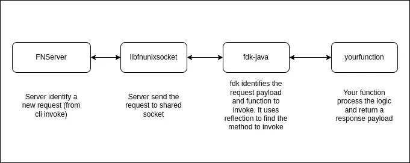

<style >
  .small-text {
    font-size: 0.55rem;
  }
</style>

# **Rodando JAVA em ambientes container**

As melhores estratégias para minimizar o tempo de startup da JVM

## George Tavares

---

# Tópicos

- Tier Compilation
- Classloader Issues
- Container Size
- Native Compilation
- Crac

---

# Tier Compilation

Habilidade de configurar qual o nível de otimização a JVM vai alcançar:


```
docker run -it -p 8080:8080 -e JAVA_OPTS_APPEND=-XX:TieredStopAtLevel=4 quarkus/simple
docker run -it -p 8080:8080 -e JAVA_OPTS_APPEND=-XX:TieredStopAtLevel=1 quarkus/simple
```

<a class="small-text" href="https://jpbempel.github.io/2020/05/22/startup-containers-tieredcompilation.html">https://jpbempel.github.io/2020/05/22/startup-containers-tieredcompilation.html</a>

---

# Tier Compilation

```
docker run --cpus=1 -it -p 8080:8080 -e JAVA_OPTS_APPEND=-XX:TieredStopAtLevel=4 quarkus/simple
docker run --cpus=1 -it -p 8080:8080 -e JAVA_OPTS_APPEND=-XX:TieredStopAtLevel=1 quarkus/simple
```


```
curl http://localhost:8080/hello/compiletime
```

---

# E o classloader? Ele pode ser mais esperto?

- Class Data Sharing/App Data sharing
- Classloader convencional procura as classes nos jars da aplicação de uma forma linear O(n)
- Quarkus fast-jar gera um "HashMap" da localização da classe no classpath

```
docker build -f src/main/docker/Dockerfile.legacy-jar -t quarkus/code-with-quarkus-legacy-jar .
docker build -f src/main/docker/Dockerfile.jvm -t quarkus/code-with-quarkus-jvm .
```

```
docker run -i --cpus=0.7 --rm -p 8080:8080 quarkus/code-with-quarkus-legacy-jar
docker run -i --cpus=0.7 --rm -p 8080:8080 quarkus/code-with-quarkus-jvm
```

---

# Quanto o tamanho pode afetar o startup

## Size

- onbuild: 700M
- multistage: 12M

## Pull

- Onbuild: 26s
- multistage: 6s

<a class="small-text" href="https://cloud.google.com/blog/products/containers-kubernetes/kubernetes-best-practices-how-and-why-to-build-small-container-images">https://cloud.google.com/blog/products/containers-kubernetes/kubernetes-best-practices-how-and-why-to-build-small-container-images</a>

---

# Build de imagem jvm do quarkus

[Dockerfile.jvm](code-with-quarkus/src/main/docker/Dockerfile.jvm)

```bash
docker build -f src/main/docker/Dockerfile.jvm -t quarkus/code-with-quarkus-jvm .
```

```bash
docker images |grep code-with-quarkus-jvm
```

Usando imagem ubi8 da redhat, com a JVM da redhat

---

# Build de imagem jvm da distroless

[Dockerfile.distroless](code-with-quarkus/src/main/docker/Dockerfile.distroless)

```bash
docker build -f src/main/docker/Dockerfile.distroless -t quarkus/code-with-quarkus-distroless .
```

```bash
docker images |grep code-with-quarkus-distroless
```

Distroless são containers mais enxutos, contendo o mínimo de um debian, SEM shell (existe versão com/sem shell de debug, rodando como root/nonroot)
_Seguranca_

---

# Build de imagem jvm da distroless customizado

[Dockerfile.customdistroless](code-with-quarkus/src/main/docker/Dockerfile.customdistroless)

```bash
docker build -f src/main/docker/Dockerfile.customdistroless -t quarkus/code-with-quarkus-customdistroless .
```

```bash
docker images |grep code-with-quarkus-customdistroless
```

---

# JLink - Jigsaw

[Dockerfile.jlink](code-with-quarkus/src/main/docker/Dockerfile.jlink)

- Permite customizar jvm que vai rodar
- Multistage-build
- _jdeps_ permite vasculhar o que seu programa usa
- pode ir rodando e descobrir o que vai faltando

```
docker build -f src/main/docker/Dockerfile.jlink -t distromini .
```

---

# E o nativo?

[Dockerfile.native-micro](code-with-quarkus/src/main/docker/Dockerfile.native-micro)

```
docker build -f src/main/docker/Dockerfile.native-micro -t quarkus/code-with-quarkus-micronative .
```

```bash
docker images |grep code-with-quarkus-micronative
```

---

<style scoped>
  {
  font-size: 18px
  }
</style>

# Compilação nativa - Drawbacks

```
Arrays.stream(persons)
  .filter(p -> p.getEmployment() == Employment.EMPLOYED)
  .filter(p -> p.getSalary() > 100_000)
  .mapToInt(Person::getAge)
  .filter(age -> age > 40)
  .average()
  .getAsDouble();

```


<a class="small-text" href="https://www.baeldung.com/jvm-tiered-compilation">https://www.baeldung.com/jvm-tiered-compilation</a>
<a class="small-text" href="https://www.graalvm.org/latest/reference-manual/native-image/guides/optimize-native-executable-with-pgo/">https://www.graalvm.org/latest/reference-manual/native-image/guides/optimize-native-executable-with-pgo/</a>

---

# Crac - Coordinated Restore at Checkpoint

- Técnica de gerar snapshots do processo java e restaurar deste ponto
- Criu
- Interface de callbacks para ajustar os recursos volateis
- AWS Snapstart
- Azul Zulu JVM já possui suporte
- Eclipse Open J9/Instant On

<a class="small-text" href="https://www.azul.com/blog/reduce-java-application-startup-and-warmup-times-with-crac/">https://www.azul.com/blog/reduce-java-application-startup-and-warmup-times-with-crac/</a>
<a class="small-text" href="https://foojay.io/today/how-we-developed-the-eclipse-openj9-criu-support-for-fast-java-startup/">https://foojay.io/today/how-we-developed-the-eclipse-openj9-criu-support-for-fast-java-startup/</a>

---

# Fn project

- oracle function
- possui uma infraestrutra disponivel para testes locais com docker

```
docker run --rm -i --name fnserver -v $HOME/.fn/iofs:/iofs -e FN_IOFS_DOCKER_PATH=$HOME/.fn/iofs \
 -e FN_IOFS_PATH=/iofs -v $HOME/.fn/data:/app/data -v /var/run/docker.sock:/var/run/docker.sock  \
 --privileged -p 8080:8080 --entrypoint ./fnserver tanquetav/fn-crac:latest
fn deploy --app server --local
fn invoke server fndemo
```



<a class="small-text" href="https://tavares-george.medium.com/using-crac-with-the-fn-project-d5ea6ac64cb0">https://tavares-george.medium.com/using-crac-with-the-fn-project-d5ea6ac64cb0</a>

---

# George Tavares

##### Desenvolvedor na Noson

##### Devops na arqgen

- Entusiasta de tecnologia, adoro estudar infraestrutura e devops
- Tiro certificações nas horas vagas: 4xAWS, 5xAZURE, CKA, CKS, Elastic Engeneering, Elastic Observability …
- Vencedor do 1o K8S ULC da Linuxtips

### https://github.com/tanquetav/tdcbusiness2023


### https://www.linkedin.com/in/tavaresgeorge/

Perguntas?
